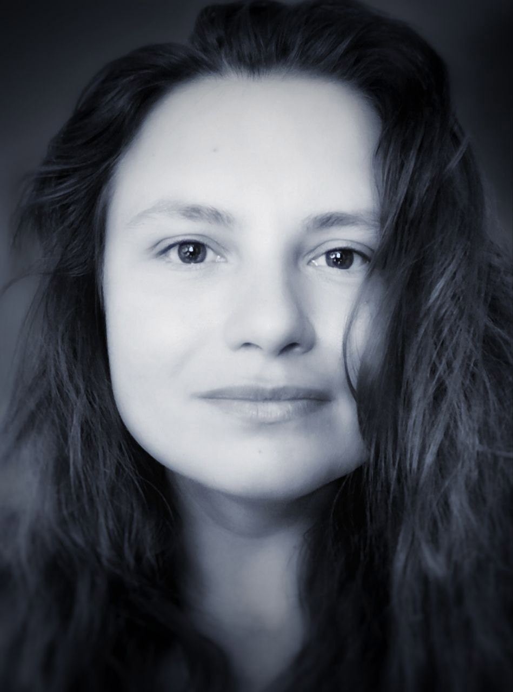

  

# Liubov Agafonova
## Contact Information
- **Address:** Podgorica, Montenegro
- **Phone:** [+382-67-881-036](tel:+38267881036)
- **Discord:** [Ljubav(Ljubava87)#1150](https://discordapp.com/users/1150)
- **Email:** babalubie@gmail.com
- **LinkedIn:** [Ljubava Agafonova](www.linkedin.com/in/ljubava-undefined-721526254)

## Summary
With a burning desire to learn and grow, I am ready to take on new challenges at RS School. My background in media, design, and IT training allows me to be a versatile professional. I have successfully worked for a socio-political publication as a photojournalist, correspondent and typesetter. Promoting science and creating press releases, I was active in the press office of the world's leading aviation science center. I also did graphic and web design and created media support for music festivals. My latest achievement is the completion of the "Software Testing" course at the world's leading IT company First Line Software. I am ready to use my experience and knowledge to actively participate in the RS School projects and to continue developing in the IT sphere.

## Education
- **Graduate in organizational management**
  The state university of management, Moscow, Russia
  Graduation Year: 2011

- **Specialist in manual testing of software**
  First Line Software QA Engeneer School, Budva, Montenegro
  Graduation Year: 2023

## Skills
- Adobe Photoshop
- Adobe InDesign
- Figma
- Tilda
- Basic HTML, CSS, JS, Git, VSCode, WebStorm skills
- Video editing and video processing - skills.
- Ability to write quality texts and articles.
- Fundamentals of PR work to effectively promote information.
- Organization of meetings and events.

## Language Skills
- Russian: Native
- English: Upper-Intermediate (B2)
- Serbian: Pre-Intermediate (A2)

## Work Experience
### Graphic designer
**Freelance**, Podgorica, Montenegro
*March, 20 2022 - present*

- Creation of corporate identity for clients.
- Development of logos.
- Creation of promotional products.
- Website design and development.

### PR specialist
**[The Central Aerohydrodynamic Institute](http://tsagi.com/)**, Moscow, Russia
*December 2, 2011 - August 2, 2022*
- Writing press releases and popular science articles.
- Photography of people, objects and events.
- Organizing media meetings.
- Conducting interviews with scientists, engineers and top management, including foreign aviation and scientific organizations (such as Boeing, Airbus, Embraer, NASA, etc.).
- Design and layout of promotional products.
- Popularizing science to the masses.

### Executive secretary, journalist, photojournalist
**[Social and political publication Aviagrad](https://inzhukovskiy.ru/)**, Zhukovsky, Moscow region, Russia
*December 2, 2006 - November 2, 2011*
- Full cycle of creation of the printed and Internet edition.
- Planning and organization of editorial activities.
- Writing articles and visualization of materials.
- Artistic editing and proofreading of journalistic materials.
- Creation of advertising strategy of the edition.

## Projects
### [Creating a slider for Eco-cafe "FreshGO"](https://ljubava87.github.io/freshgocafe-slider/)
Creating a slider as part of a marathon on frontend development from the Result School
*Podgorica, Montenegro*

*[See the project](https://github.com/Ljubava87/slders-disign.git)*

### [Creating a slider for my works](https://ljubava87.github.io/slders-disign/)
Creating a slider as part of a marathon on frontend development from the Result School
*Podgorica, Montenegro*

*[See the project](https://github.com/Ljubava87/slders-disign.git)*

### [Creating a minigame](https://ljubava87.github.io/LemonGame/)
Creating a minigame as part of a marathon on frontend development from the Result School
*Podgorica, Montenegro*

*[See the project](https://github.com/Ljubava87/LemonGame.git)*

